# Documentación Técnica - Práctica 1: Monte Alto y la conectividad

**Grupo 9**
**Repositorio:** `REDES2_1S2026_G9`

---

## FASE 1: Infraestructura Base, Nombres, VLANs y VTP

**Responsable:** Marcelo André Juarez Alfaro (202010367)

### 1.1 Objetivo de la Fase

Establecer la base física y lógica de la red de la institución Monte Alto. Esto incluye el despliegue de dispositivos, estandarización de nombres (hostnames), configuración de enlaces troncales y la segmentación de la red de Capa 2 mediante VLANs propagadas de forma centralizada utilizando el protocolo VTP.

### 1.2 Tabla de Direccionamiento IP y Asignación de VLANs

A continuación, se detalla el esquema de direccionamiento estático aplicado a los hosts de la topología. Las direcciones IP se calcularon en base a los requerimientos del Grupo 9, dejando la primera IP utilizable (.1) reservada para el Gateway (configurado en la Fase 2).

| Dispositivo | Ubicación (Edificio)     | VLAN Asignada | Dirección IPv4 | Máscara de Subred | Default Gateway |
| :---------- | :----------------------- | :------------ | :------------- | :---------------- | :-------------- |
| **PC1**     | Izquierdo (Primaria)     | VLAN 19       | 192.178.19.10  | 255.255.255.0     | 192.178.19.1    |
| **PC2**     | Izquierdo (Básicos)      | VLAN 29       | 192.178.29.11  | 255.255.255.0     | 192.178.29.1    |
| **Laptop1** | Izquierdo (Básicos)      | VLAN 29       | 192.178.29.10  | 255.255.255.0     | 192.178.29.1    |
| **PC4**     | Izquierdo (Bachillerato) | VLAN 39       | 192.178.39.10  | 255.255.255.0     | 192.178.39.1    |
| **PC5**     | Izquierdo (Bachillerato) | VLAN 39       | 192.178.39.11  | 255.255.255.0     | 192.178.39.1    |
| **PC6**     | Derecho (Primaria)       | VLAN 69       | 192.178.69.10  | 255.255.255.0     | 192.178.69.1    |
| **PC7**     | Derecho (Básicos)        | VLAN 79       | 192.178.79.10  | 255.255.255.0     | 192.178.79.1    |
| **Laptop2** | Derecho (Básicos)        | VLAN 79       | 192.178.79.11  | 255.255.255.0     | 192.178.79.1    |
| **PC3**     | Derecho (Bachillerato)   | VLAN 89       | 192.178.89.10  | 255.255.255.0     | 192.178.89.1    |
| **PC8**     | Derecho (Bachillerato)   | VLAN 89       | 192.178.89.11  | 255.255.255.0     | 192.178.89.1    |

### 1.3 Mapeo de Conexiones Relevantes (Capa 2)

_(Esta tabla representa la arquitectura general aplicada en toda la topología)_

| Nivel Jerárquico      | Dispositivo Local                 | Tipo de Interfaz                 | Conectado hacia...                   | Configuración de Puerto  |
| :-------------------- | :-------------------------------- | :------------------------------- | :----------------------------------- | :----------------------- |
| **Distribución**      | VTP Servers (`SW0_G9`, `SW13_G9`) | FastEthernet (Ej. Fa0/1 - Fa0/3) | Switches Intermedios                 | `switchport mode trunk`  |
| **Acceso/Intermedio** | VTP Clients (Capa Intermedia)     | FastEthernet                     | Switches Superiores e Inferiores     | `switchport mode trunk`  |
| **Acceso Inferior**   | VTP Clients (Switches Base)       | FastEthernet 0/10                | Dispositivos Finales (PCs / Laptops) | `switchport mode access` |

### 1.4 Evidencias de Configuración (Capturas de Verificación)

Se adjuntan las comprobaciones de estado de los protocolos configurados en Cisco Packet Tracer para respaldar la correcta funcionalidad de la red:

**A. Verificación de VTP (VLAN Trunking Protocol)**
Ejecución del comando `show vtp status` en un switch cliente comprobando la sincronización con el dominio `G9` y la recepción de la base de datos de VLANs.

 


**B. Verificación de Puertos de Acceso y VLANs**
Ejecución del comando `show vlan brief` comprobando que las VLANs se crearon correctamente y que los puertos conectados a los usuarios (Ej. Fa0/10) fueron asignados al grupo correcto.


**C. Verificación de Enlaces Troncales**
Ejecución del comando `show interfaces trunk` en un switch intermedio, confirmando que las interfaces permiten el tráfico etiquetado 802.1Q de múltiples VLANs.


**D. Pruebas de Conectividad (Capa 2)**
Comprobación de conectividad a través de ICMP (`ping`) entre equipos pertenecientes a la **misma VLAN** dentro del **mismo edificio** y **diferentes VLAN**.


---

## FASE 2: Inter-VLAN, Port-Security y Spanning Tree (STP)

**Responsable:** Susana Paola González Contreras (202000576)

### 2.1 Objetivo de la Fase
El objetivo principal de esta sección consistió en diseñar, asegurar y validar una arquitectura de red escalable y redundante para la infraestructura de ambos edificios. Mediante la implementación de **Spanning Tree Protocol (PVST y Rapid PVST)**, se garantizó una topología de Capa 2 libre de bucles, optimizando los tiempos de convergencia y forzando la elección determinista de los puentes raíz (Root Bridges) para asegurar la disponibilidad de la red. Simultáneamente, se fortaleció la capa de acceso aplicando **Port-Security**, restringiendo las conexiones físicas exclusivamente a las direcciones MAC de los dispositivos finales autorizados para mitigar riesgos de intrusión. Finalmente, se estableció la comunicación entre redes lógicamente aisladas a través del enrutamiento **Inter-VLAN** (arquitectura *Router-on-a-Stick*), logrando una interconectividad exitosa y controlada entre los departamentos de Primaria, Básicos y Bachillerato.

### 2.2 Tabla de Subinterfaces y Gateways

| Interfaz Física | Subinterfaz | VLAN | Nombre/Departamento | IP (Default Gateway) | Máscara de Subred |
| :--- | :--- | :--- | :--- | :--- | :--- |
| GigabitEthernet0/1 | G0/1.19 | 19 | Primaria (Edificio Izquierdo) | 192.178.19.1 | 255.255.255.0 |
| GigabitEthernet0/1 | G0/1.29 | 29 | Básicos (Edificio Izquierdo) | 192.178.29.1 | 255.255.255.0 |
| GigabitEthernet0/1 | G0/1.39 | 39 | Bachillerato (Edificio Izquierdo) | 192.178.39.1 | 255.255.255.0 |
| GigabitEthernet0/1 | G0/1.69 | 69 | Primaria (Edificio Derecho) | 192.178.69.1 | 255.255.255.0 |
| GigabitEthernet0/1 | G0/1.79 | 79 | Básicos (Edificio Derecho) | 192.178.79.1 | 255.255.255.0 |
| GigabitEthernet0/1 | G0/1.89 | 89 | Bachillerato (Edificio Derecho) | 192.178.89.1 | 255.255.255.0 |

### 2.3 Bloque de Comandos CLI (Port-Security & STP)
**Comandos del Lado Izquierdo (VLAN 29 y PVST)**
```
enable
configure terminal
interface FastEthernet 0/10
 switchport mode access
 switchport access vlan 29
 switchport port-security
 switchport port-security maximum 1
 switchport port-security mac-address sticky
 switchport port-security violation shutdown
 exit

spanning-tree mode pvst
```


**Comandos del Lado Derecho (VLAN 79 y Rapid PVST)**
```
enable
configure terminal
interface FastEthernet 0/10
 switchport mode access
 switchport access vlan 79
 switchport port-security
 switchport port-security maximum 1
 switchport port-security mac-address sticky
 switchport port-security violation shutdown
 exit

spanning-tree mode rapid-pvst
```

### 2.4 Tabla Comparativa de Convergencia STP

| Edificio | Protocolo STP | Tiempo de Convergencia | Justificación |
| :--- | :--- | :--- | :--- |
| **Izquierdo** | PVST | 1 min 07.11 seg | Protocolo estándar. Requiere pasar por los estados de Listening y Learning (aprox. 30-50s) antes de llegar a Forwarding. |
| **Derecho** | Rapid PVST | 1.60 seg | Protocolo optimizado (802.1w). Negocia activamente el estado del puerto, logrando una convergencia casi inmediata. |

### 2.5 Capturas y Comandos de Verificación
**show port-security interface**
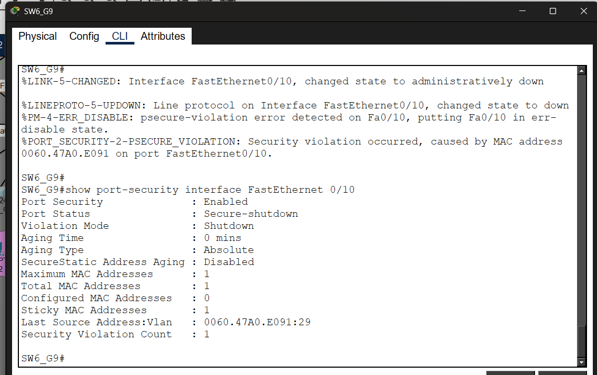

**show spanning-tree**
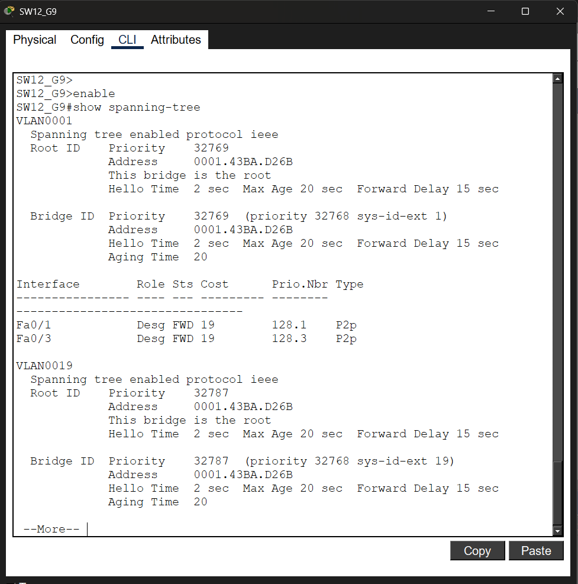

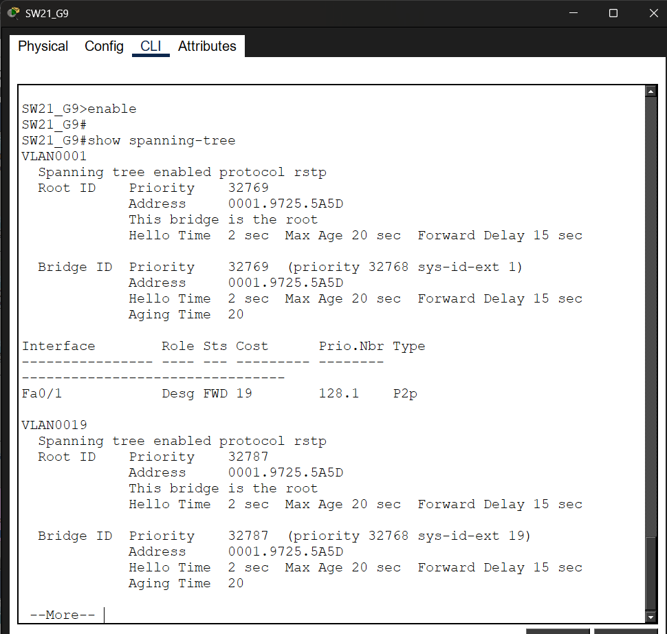

**Pings Inter-VLAN dentro del mismo edificio**
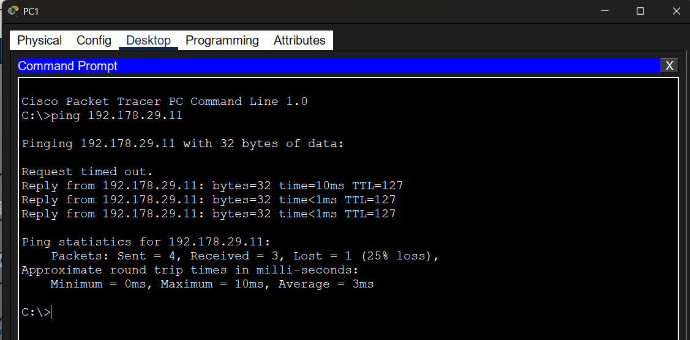

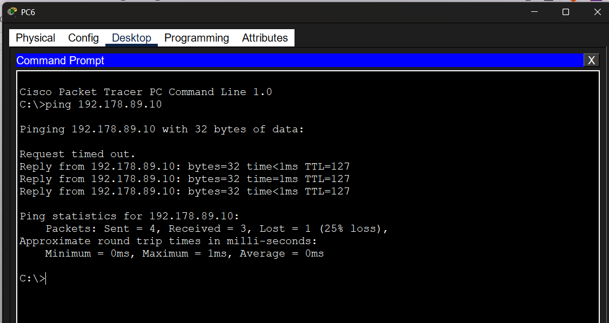


---

## FASE 3: Enrutamiento Dinámico y Pruebas Globales

**Responsable:** Jose David Mota González (202306077)

### 3.1 Objetivo de la Fase
El objetivo principal de esta fase consistió en habilitar la conectividad total de extremo a extremo en la infraestructura de red, unificando dominios que operan con diferentes protocolos de enrutamiento dinámico. Se implementó EIGRP (AS 9) para la red del edificio izquierdo, OSPF (Área 0) para el edificio derecho, y RIPv2 para los enlaces WAN del núcleo central. Para asegurar la convergencia e interoperabilidad de la topología, se configuró la redistribución mutua de rutas inyectando las métricas correspondientes en los routers de borde (Router1 y Router4). Con esto se garantizó la visibilidad de todas las subredes y el tráfico exitoso entre las VLANs de ambos edificios.

### 3.2 Tabla de Enrutamiento Dinámico

A continuación, se detalla la configuración lógica de los protocolos aplicados en cada router de la topología para establecer las adyacencias y propagar las redes.

| Router | Ubicación | Protocolo | AS / Área | Redes Declaradas (Network) |
| :--- | :--- | :--- | :--- | :--- |
| **Router0** | Edificio Izquierdo | EIGRP | AS 9 | `10.10.12.0/24`<br>`192.178.19.0/24`<br>`192.178.29.0/24`<br>`192.178.39.0/24` |
| **Router1** | Central (Enlace Izq) | EIGRP<br>RIP v2 | AS 9<br>N/A | `10.10.12.0/24` (EIGRP)<br>`10.10.11.0/24` (RIP) |
| **Router4** | Central (Enlace Der) | RIP v2<br>OSPF | N/A<br>Área 0 | `10.10.11.0/24` (RIP)<br>`10.10.10.0/24` (OSPF) |
| **Router3** | Edificio Derecho | OSPF | Área 0 | `10.10.10.0/24`<br>`192.178.69.0/24`<br>`192.178.79.0/24`<br>`192.178.89.0/24` |


### 3.3 Evidencias de Configuración (Capturas de Verificación)

Se adjuntan las comprobaciones de estado de las tablas de enrutamiento y conectividad global en Cisco Packet Tracer para respaldar la correcta redistribución y funcionalidad de la red:

**A. Comprobación de Tablas de Enrutamiento**
Ejecución del comando `show ip route` en los routers, confirmando el aprendizaje dinámico de rutas externas provenientes de la redistribución (etiquetas **D EX** para EIGRP y **O E2** para OSPF).

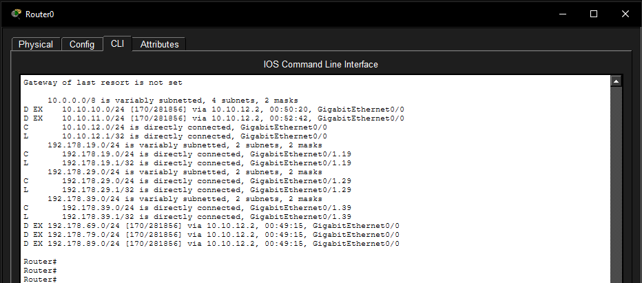
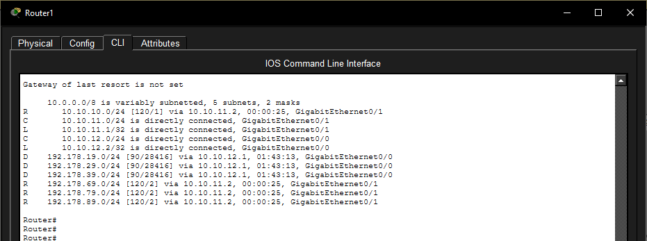
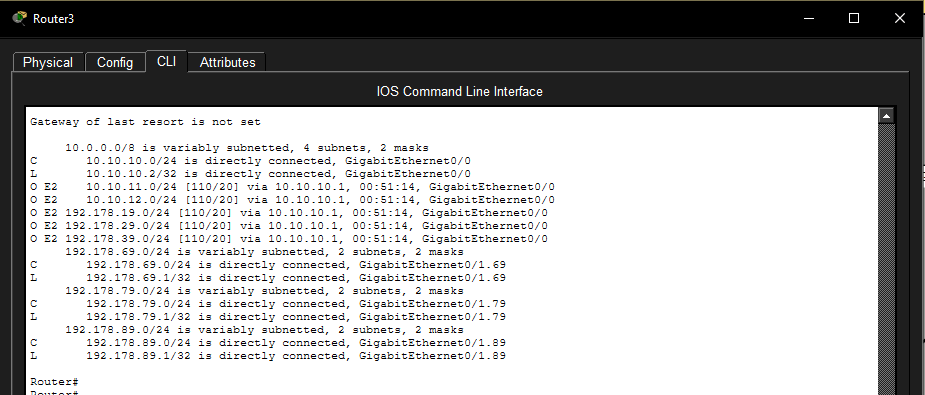
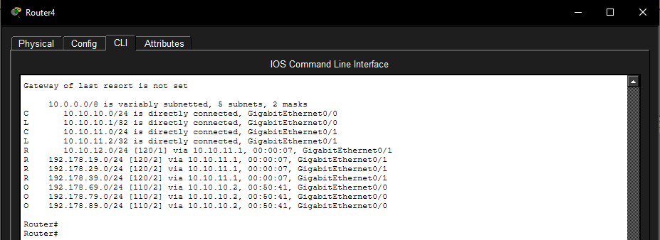

**B. Matriz de Pruebas Globales (Conectividad Extremo a Extremo)**
Comprobación de conectividad a través de ICMP (`ping`) entre equipos de diferentes departamentos y edificios, atravesando el núcleo central de la red.

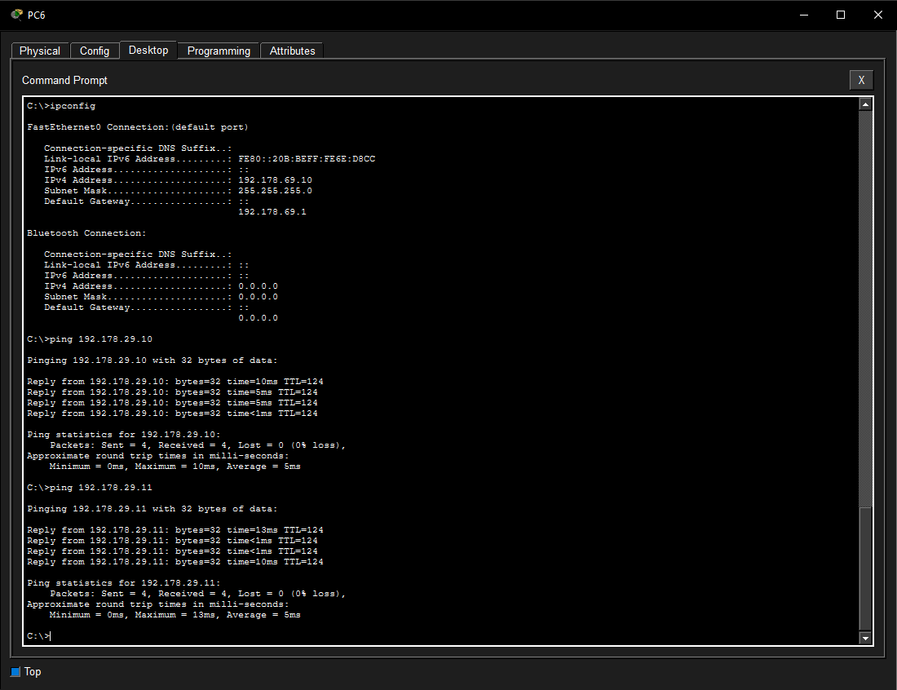
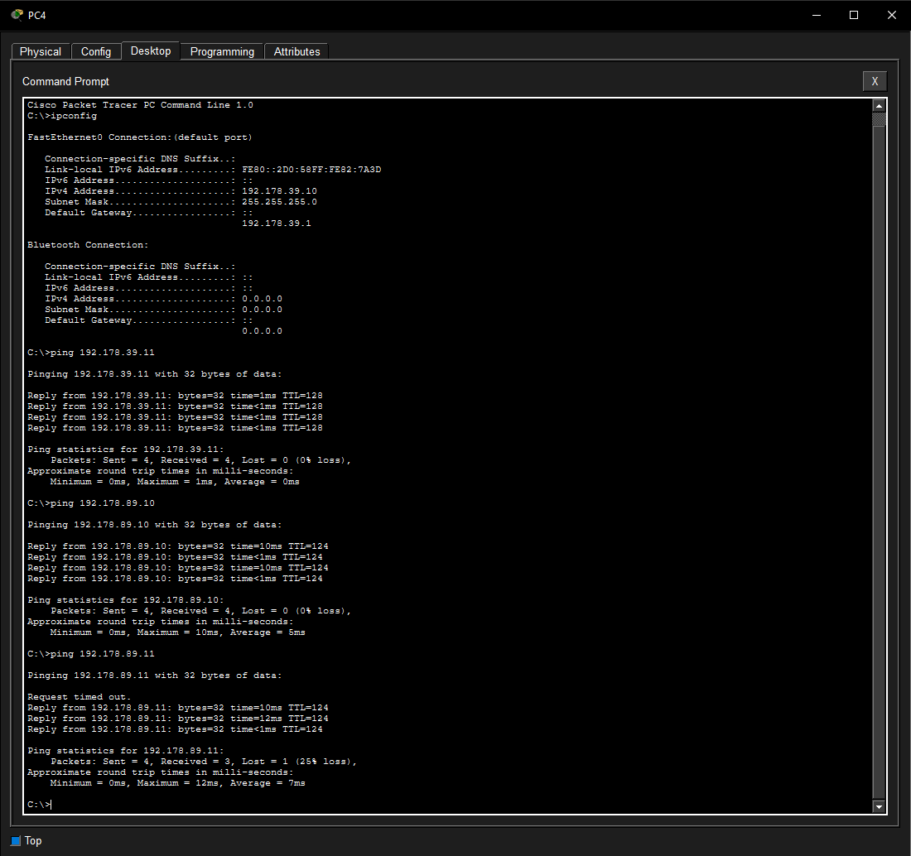
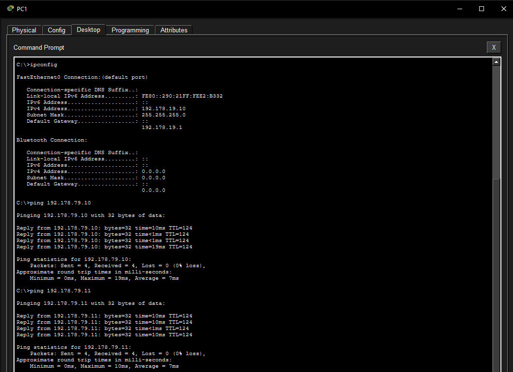

**C. Topología Consolidada**
Vista general de la arquitectura de red finalizada, completamente convergida y con todos los enlaces físicos activos.

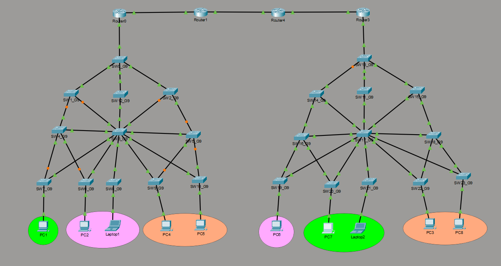

---

*(Fin de la Fase 3 y consolidación del proyecto. El archivo `.pkt` finalizado ha sido verificado e integrado en la rama de producción).*