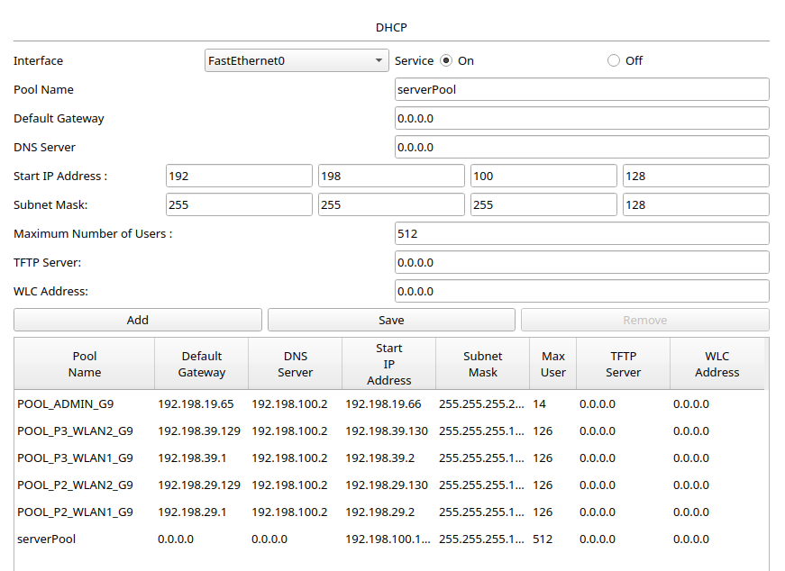

## Diseño de Arquitectura y Subnetting (VLSM y FLSM)

| Ubicación  | VLAN             | Subred Asignada | Máscara / CIDR        | Rango de Hosts Utilizables        |
| :--------- | :--------------- | :-------------- | :-------------------- | :-------------------------------- |
| Piso 1     | Estudiantes (29) | 192.198.19.0    | 255.255.255.192 (/26) | 192.198.19.1 - 192.198.19.62      |
| Piso 1     | Admin (19)       | 192.198.19.64   | 255.255.255.240 (/28) | 192.198.19.65 - 192.198.19.78     |
| Piso 2     | WLAN1            | 192.198.29.0    | 255.255.255.128 (/25) | 192.198.29.1 - 192.198.29.126     |
| Piso 2     | WLAN2            | 192.198.29.128  | 255.255.255.128 (/25) | 192.198.29.129 - 192.198.29.254   |
| Piso 3     | WLAN1            | 192.198.39.0    | 255.255.255.128 (/25) | 192.198.39.1 - 192.198.39.126     |
| Piso 3     | WLAN2            | 192.198.39.128  | 255.255.255.128 (/25) | 192.198.39.129 - 192.198.39.254   |
| Datacenter | Web (39)         | 192.198.100.0   | 255.255.255.128 (/25) | 192.198.100.1 - 192.198.100.126   |
| Datacenter | DHCP (49)        | 192.198.100.128 | 255.255.255.128 (/25) | 192.198.100.129 - 192.198.100.254 |

## Tabla de Asignación de Subredes (/30)

| Enlace Punto a Punto           | Subred Asignada | Rango Utilizable      | Configuración de IPs                      |
| :----------------------------- | :-------------- | :-------------------- | :---------------------------------------- |
| Multicapa Piso 1 - Router0     | 10.2.9.0/30     | 10.2.9.1 - 10.2.9.2   | Multicapa: 10.2.9.1 / Router0: 10.2.9.2   |
| Multicapa Piso 1 - Router1     | 10.2.9.4/30     | 10.2.9.5 - 10.2.9.6   | Multicapa: 10.2.9.5 / Router1: 10.2.9.6   |
| Multicapa Datacenter - Router2 | 10.2.9.20/30    | 10.2.9.21 - 10.2.9.22 | Multicapa: 10.2.9.21 / Router2: 10.2.9.22 |
| Multicapa Datacenter - Router3 | 10.2.9.24/30    | 10.2.9.25 - 10.2.9.26 | Multicapa: 10.2.9.25 / Router3: 10.2.9.26 |

## Gestión de VLANs

Se implementó la segmentación lógica de la red mediante la creación de cuatro VLANs principales, asignadas según los requerimientos de los distintos departamentos de la biblioteca:

- **VLAN 19 (ADMIN):** Asignada a los equipos del personal de administración en el Piso 1.
- **VLAN 29 (ESTUDIANTES):** Asignada a las computadoras de los estudiantes en el Piso 1.
- **VLAN 39 (WEB_SERVERS):** Dedicada a aislar el tráfico del servidor HTTP/DNS en el Datacenter.
- **VLAN 49 (DHCP_SERVERS):** Dedicada al servidor que proveerá el direccionamiento dinámico a toda la red.

Estas VLANs fueron creadas tanto en los switches multicapa de distribución como en los switches de acceso perimetrales (Capa 2), garantizando que los dispositivos finales puedan etiquetar su tráfico correctamente.

## Agregación de Enlaces (LACP)

Para interconectar los edificios (Piso 1, Piso 2, Piso 3 y Datacenter) garantizando tolerancia a fallos y un alto ancho de banda, se configuró el protocolo LACP.

- Se utilizaron 4 interfaces FastEthernet físicas por cada conexión entre edificios.
- Los grupos de canales (Port-Channels 1, 2 y 3) fueron configurados en `mode active`, lo que permite que las interfaces negocien activamente la formación del enlace troncal, asegurando que si un cable físico sufre un corte, el tráfico se redistribuya automáticamente por los cables restantes sin pérdida de conectividad.

## Alta Disponibilidad (HSRP)

Se implementó el protocolo HSRP para asegurar que las VLANs mantengan su salida hacia otras redes incluso si un router de distribución falla.

- **Configuración Piso 1:** El Router 1 fue configurado como el equipo `Active` (Prioridad 110) para las VLANs 19 y 29, mientras que el Router 2 quedó como `Standby` (Prioridad 100 por defecto).
- **Configuración Datacenter:** El Router 1 del Datacenter actúa como equipo principal (Prioridad 110) para las VLANs 39 y 49, con el Router 2 como respaldo.
- Se activó la función `preempt` en todos los routers principales. Esto asegura que, si el router primario sufre una caída y luego se reinicia, retomará automáticamente su rol de líder sin necesidad de intervención manual, devolviendo la red a su estado óptimo.

**3. Configuraciones DHCP**

- **Servidor Central (Server1):** Se configuraron los pools DHCP para la red cableada (VLANs 19 y 29) y para las redes inalámbricas (WLANs del Piso 2 y 3). Todos los pools apuntan al servidor DNS 192.198.100.2.

- **Routers Inalámbricos (WRT300N):** Los 4 routers están configurados con "Automatic Configuration - DHCP" en su interfaz de Internet, recibiendo IPs de sus respectivas VLANs segmentadas para repartir el direccionamiento a los dispositivos finales.

**4. Configuración de Servidor WEB y DNS**

- **Dominio:** www.practica2_Grupo9.com
- El servidor DNS (Server0) resuelve exitosamente el dominio a su dirección IP 192.198.100.2.
- [Insertar captura del navegador web de una PC o Smartphone mostrando la página estática con los datos de los integrantes del Grupo 9]

**5. Verificación de la Infraestructura (Comandos Show)**

- **Enrutamiento EIGRP:**
  
- **Redundancia HSRP:**
  
- **Agregación de Enlaces LACP:**
  

**6. Pruebas de Conectividad (Pings)**

- **Comunicación Inter-VLAN:** Prueba de conexión desde la VLAN ESTUDIANTES (Piso 1) hacia la VLAN ADMIN (Piso 1).
  [Insertar captura de la terminal haciendo ping]
- **WLAN a Datacenter:** Prueba de conexión desde un Smartphone o Laptop inalámbrico (Piso 2 o 3) hacia el Servidor Web.
  [Insertar captura de la terminal haciendo ping]
